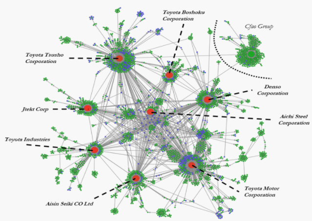
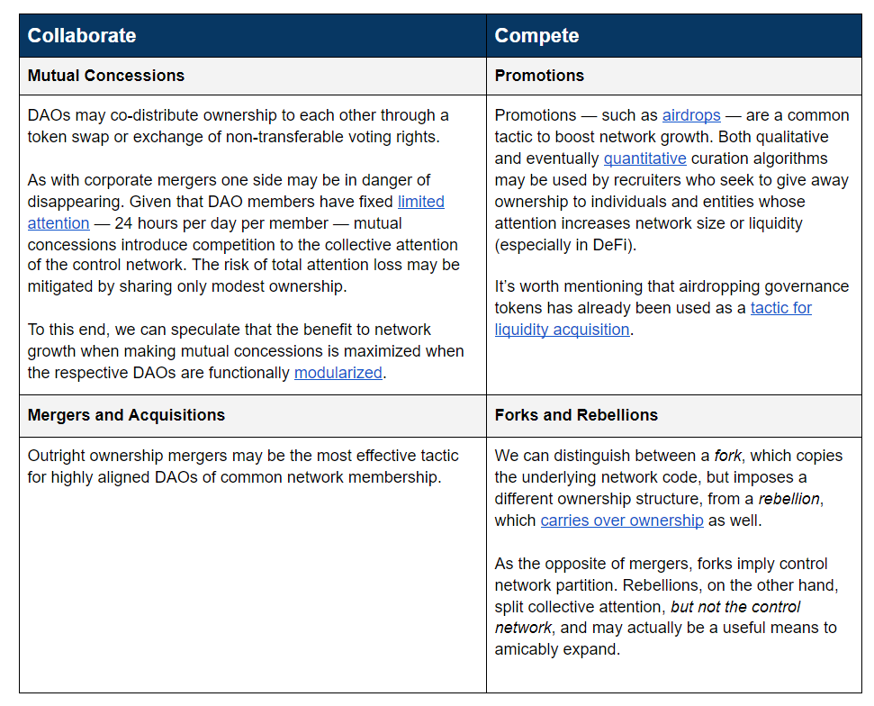
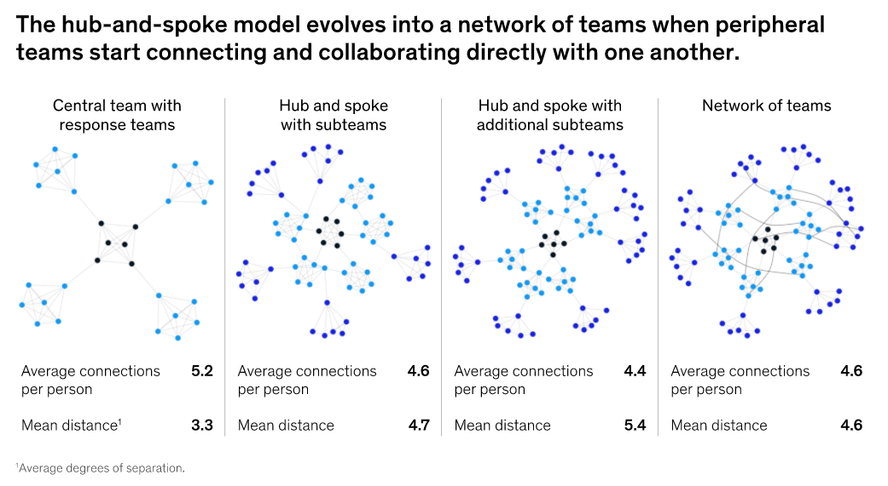

**Source:** ["Ownership in Cryptonetworks" by Pat Rawson from Curve Labs](https://blog.curvelabs.eu/ownership-in-cryptonetworks-96f13f4a113e)

# Ownership in cryptonetworks

The author aims to answer **two questions**:
- Can a DAO decentralize ownership effectively?
- If so, does it make sense to do so?

## Control cryptonetworks

The author defines ownership in DAOs as a **quantitative measure** of one’s **decision-making authority** over a given **treasury**.

Ownership in DAOs exists either as a transferable ERC20 token or as a non-transferrable score. Whether or not this value is transferable, both types of values can be used to **populate a control network** whose **graph edges** are a **quantitative measure of ownership**.

There are certain key ownership types, such as a DAO >50% of the ownership of another DAO, creating a **nested structure**.
- In some cases, the treasury of the subordinate DAO is independent and freely utilized by its governing body, resembling a **subsidiary**.
  - This creates a **two-node control network**.
  - Example: Omen Guild's [sub-DAO relationship](https://gateway.pinata.cloud/ipfs/QmRcqcAtJqNNzXTre4x7GevxUDE3Z3KyCUCyfxDwaC9Zdd) to DXdao
- In other cases, spending needs to be approved by the parent, resembling an **internally integrated business segment**.
  - This is akin to an **internal accounting system**.
  - Example: [Minion](https://medium.com/@thelaoofficial/the-path-to-unaccredited-daos-with-minion-8113213f7195) framework

### Control network of the Toyota Group

- Red nodes indicate (interlocked) parent companies
- Green nodes represent majority-owned subsidiaries
- Blue nodes are affiliates with a dominant stake in equity.

Compared to a transnational corporation (TNC) like Toyota, there is no [fractalized](https://ecosystem.daoincubator.org/fractalizing/fractalization-process) control network in blockchain today, as few DAOs spin ownership and financing out of themselves into their local organizational neihborhood.

### Control network of Uniswap

The Uniswap treasury (as of March 2021) is worth $1.4B, 10 times less than PayPal's $14B of cash and short term investments in 2020. However, while PayPal spent $18.16B on OPEX, Uniswap has spent over 100 times less than its treasury size, according to the author's calculations.

The spin-out of the $3m/year Uniswap grants program resembles the formation of a new subsidiary. Therefore, we could say that **Uniswap's control network has three nodes**, all independent because they freely govern separate treasuries:

1. The DAO
2. The business proper
3. The grants council

But a high number of investment and VC funds hold UNI tokens, which highlights that **DAOs collide with traditional institutions** like investment funds and speculative TNCs, which are in turn interconnected with other institutions of the global core's [large connected component](http://www.nlcpr.com/gobalcontrol.php).

### Long-term issues with crypto-institutional autonomy

The author argues that this dynamic is problematic in the long run, and that a tension is emerging between two possible futures:

- DAO ownership becomes in large part **subsumed and instrumentalized by centralized financial institutions and TNCs**.
  - Ideas like DAO-governed commons become meaningless over time as DAOs ultimately congeal into speculatory investment vehicles.
  - The large connected component simply eats the crypto-institutional young.
- DAOs endogeneously structure a **self-sovereign, crypto-institutional control network of their own**.
  - They pursue a topology advantageous to scaling a core of collaborative governance entities, like [crypto-institutional commons](https://medium.com/commonsstack/architecting-the-cyber-physical-commons-a294d88b5415).
  - Centralized institutions move towards decentralization to more favorably integrate with the cryptosphere, assuming DAOs effectively enforce new crypto-institutional norms in international affairs.

The question of “how to spend a billion dollars most effectively?” is better reframed as: “How do you distribute ownership effectively across organizations in a given control network?”

DAOs today lack the means to distribute ownership effectively. To foster crypto-institutional resilience vs. TNC instrumentalization, **DAOs need cooperation, distribution, and sense-making tooling**, such as:

- Descriptive map(s) of their control network neighborhood
- Match-making algorithms to know which organizational neighbors and skillful agents are useful to engage (or alternatively, which neighbors may be hostile)
- Negotiation interfaces and protocols that help accelerate mergers, acquisitions, and trade ([DAO-to-DAO interactions](https://medium.com/primedao/conceptual-models-for-dao2dao-relations-ac2b2d3cc84d))
- Computational social choice algorithms like [quadratic funding](https://vitalik.ca/general/2019/12/07/quadratic.html), [conviction voting](https://medium.com/giveth/conviction-voting-a-novel-continuous-decision-making-alternative-to-governance-aa746cfb9475), and [pairwise preferencing](https://blog.colony.io/introducing-budgetbox/) to intelligently distribute large sums of capital and ownership through neighborhoods
- More specific ways to define ownership rights — i.e. What do I own? [Cash-flow rights](https://www.investopedia.com/investing/read-corporate-cash-flow-statement/)? [Monetized data incomes](https://arxiv.org/abs/1905.08819)?
- Effective signaling and feedback interfaces to align the polis on control network strategy

The author observes mainly two types of DAO-to-DAO interactions taking place at the moment:
- **Token airdrops** with the intent of [stripping network liquidity away from competitors](https://cointelegraph.com/news/defi-aggregator-1inch-stages-new-vampire-airdrop-to-uniswap-users).
- **Seditious forks/rebellions**.

Compared to these, the number of mergers, acquisitions, and mutual concessions is almost negligible. Unlike the aforementioned DAO-to-DAO interactions, these are costly to implement and require bespoke tooling. The industry is still immature, but [token swaps](https://medium.com/api3/announcing-the-api3-partnership-and-token-swap-with-pocket-network-f45420790b6c), [mergers](https://forum.keep.network/t/proposal-keep-and-nucypher-hard-merge/74), and other more [elaborate arrangements](https://daotalk.org/t/omen-guild-and-omn-token/2591) are already underway.

We can imagine **four DAO tactics for ownership distribution and dissolution**:

## Optimizing crypto-institutional resilience

With the advent of DeFi and VC money flooding in, centralized financial capital now disproprotionately occupies the crypto-institutional niche of organizational ownership, while many constituent 'builder squads' (e.g., agencies, dev shops, teams, ecosystem and event organizers) frequently find themselves cut out of a given projects' tokenomic allocation.

The author introduces a key point: ***ideology is topology***.

When choosing which structure of crypto-institutional control network aligns with his imagined second future, the author argues that **DAOs should pursue self-sovereign values**, aiming to do their **accounting in localized currencies issued by adaptive governance [collectives](https://www.uio.no/studier/emner/matnat/ifi/INF9200/v10/readings/papers/Latour2.pdf)**, rather than aim for a structure that maximizes profit and market liquidity share, denominated in monocultural, globalized fiat, as TNCs do today.

Simply put, **DAOs should find and recruit the best collection of *squads* to grow themselves**.

**From the top-down**, DAO treasuries should distribute ownership to many subsidiaries, i.e., generously fund them.

**From the bottom-up**, individual worker-owners should collectivize into effective working groups: squads that are both internal and independent entities that exist within and between DAOs.

For our baby billion dollar DAOs, **distributing ownership as skin-in-the-game to squadlike entities with more specialized objectives is the key long-term problem to solve**. The author sees many benefits beyond [incentives alignment](https://medium.com/@thomasbcox/on-aligning-stakeholder-incentives-in-blockchain-systems-75a89c80be5c) emerging from this formation:

- **For resilience to emerge in complex systems, variation must be attenuated by variation**. A diverse control network consisting of locally assortative squads is far better equipped to deal with unforeseen challenges, as long as the collective memory circulates within the cryptonetwork.
- **Squads with multiple DAO tokens have multiple liquidity sources, increasing their chance at survival and preserving the collective memory**. With overlapping forms of ownership, these polycentric meso-actors stop viewing chain or DAO-specific problems in isolation; often, solving a given issue for one actor creates a solution for another.
- **The individual shareholder is driven by greed; the network, by growth**. Squads empowered with ownership navigate and mediate this tension between micro and macro by growing the network in pursuit of squad wealth.

By allocating builders higher relative ownership, a tension is produced between stakeholders which needs to be considered in any tokenomic allocation. Which DAO is more likely to exist in the long term?

1. One that is majority-owned (75%+) by an interacting collaborative network of builders, who are self-organized by interests, objectives, and ecological niche, working both within and across multiple DAOs?
2. One that is majority-owned (75%+) by token holders and venture capitalists?

The author believes the former is clearly far more effective in the long run.

### Conclusion

Let us collectively brainstorm and approach questions of merger, acquisition, and spinoff with a little more creativity. Hopefully, DAOs who plant crypto-institutional seeds in each other will pre-emptively diffuse secessionist tendencies in their neighborhoods, leading to greater experimentation and the emergence of a self-sovereign control network. Collectively deciding who, how, and how much ownership is distributed across a given control network is tough, but the path dependencies introduced by these decisions matter, as they will define the cryptosphere’s future.
